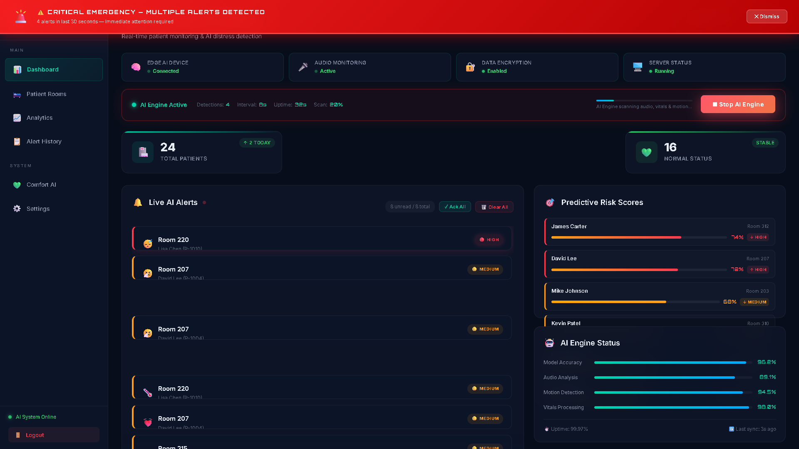
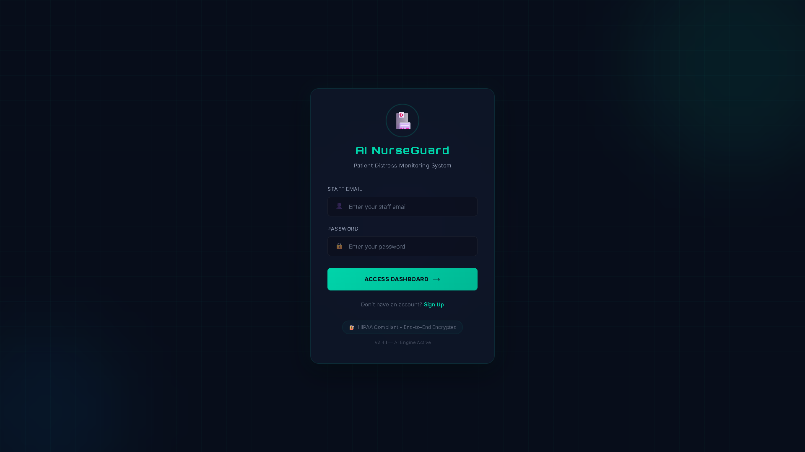
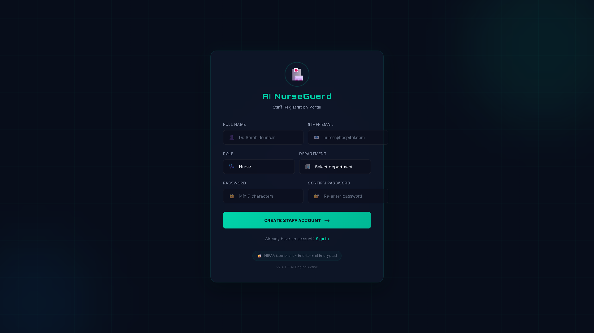
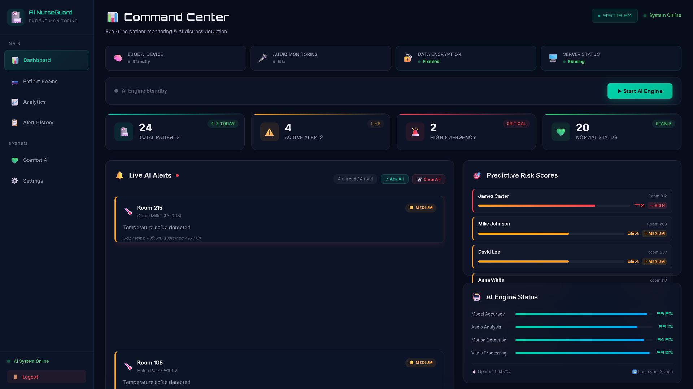
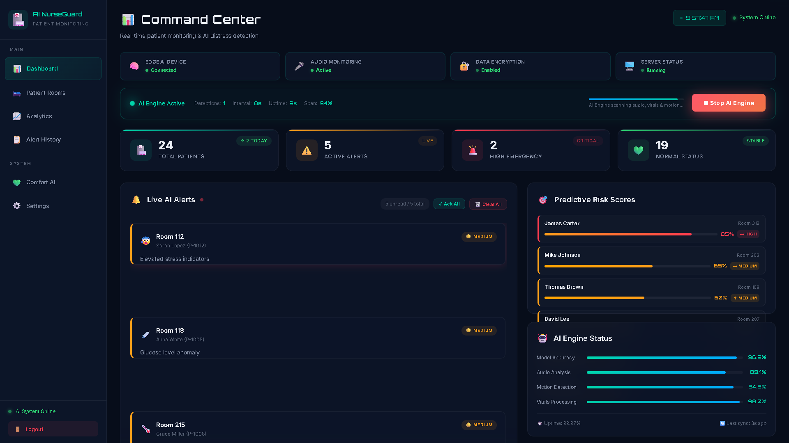
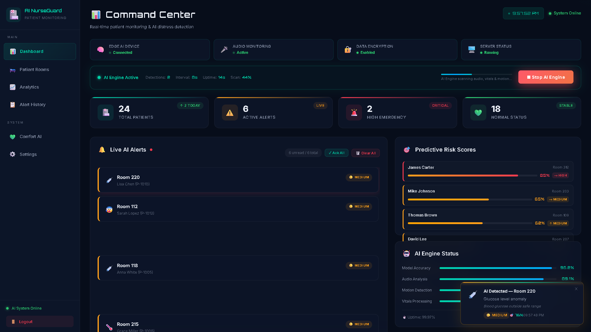
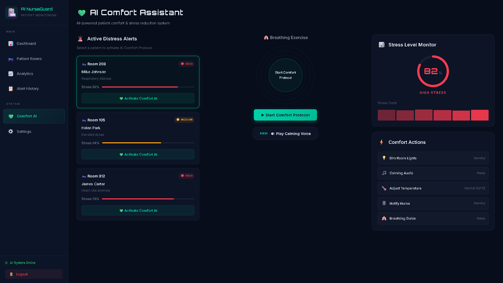
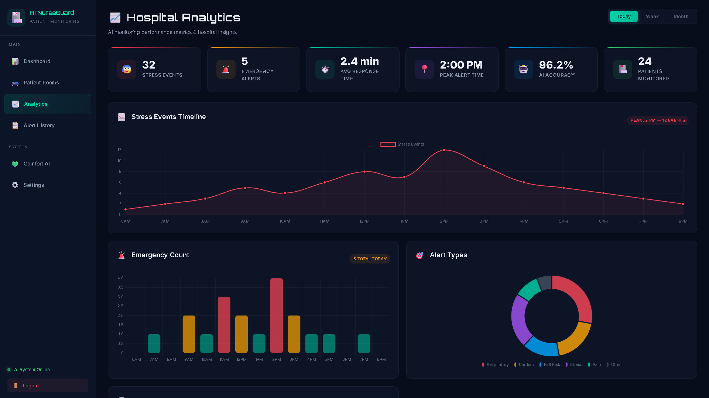
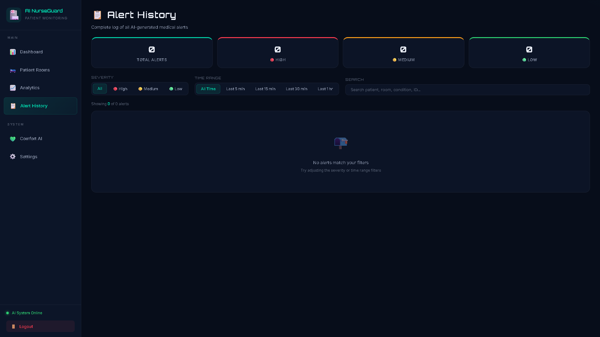
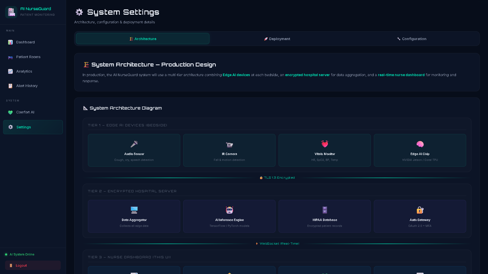

<p align="center">
  
  
  
  
  
</p>

<h1 align="center">🏥 AI-Based Acoustic Monitoring System for Early Detection of Patient Distress in Hospitals</h1>

<p align="center">
  <b>🧠 Intelligent real-time patient monitoring powered by AI acoustic analysis — detecting distress before it escalates, alerting nurses instantly, and saving lives.</b>
</p>

<p align="center">
  <i>A next-generation hospital safety system that listens, analyzes, predicts, and responds — 24/7.</i>
</p>

<p align="center">
  
</p>

<p align="center">
  <i>⬆️ Dashboard in CRITICAL EMERGENCY mode — real-time AI alerts, system indicators, predictive risk scores, and popup notifications</i>
</p>

---

## 🚀 Project Overview

**AI NurseGuard** is an AI-powered patient distress monitoring system designed to revolutionize hospital safety. Using acoustic analysis, vital signs monitoring, and motion detection, the system provides **sub-second distress detection** and **instant nurse alerts** — reducing response times from minutes to milliseconds.

> 💡 *This is a fully functional prototype demonstrating the complete monitoring workflow with simulated AI detection. The production system will integrate real-time AI models in the next development phase.*

---

## 🧠 Problem Statement

### The Crisis in Hospital Patient Safety

In hospitals worldwide, patients experience distress episodes — **respiratory failures, cardiac anomalies, panic attacks, falls, and silent deterioration** — that often go undetected until a nurse physically checks during routine rounds.

| Problem | Impact |
|---------|--------|
| ⏱️ **Delayed Detection** | Average nurse response: 2–5 minutes; critical events need sub-second detection |
| 👩‍⚕️ **Staff Shortages** | 1 nurse monitoring 6–8 patients cannot be everywhere simultaneously |
| 🔇 **Silent Distress** | Patients in pain, confusion, or respiratory failure may not call for help |
| 📊 **No Predictive Intelligence** | Current systems are reactive, not proactive |
| 📋 **Manual Monitoring** | Vitals checked periodically, not continuously |
| 💰 **Cost of Delays** | Late detection leads to ICU escalation, longer stays, and adverse outcomes |

### The Numbers Speak:

> - **400,000+** preventable hospital deaths annually (US alone)
> - **2–5 min** average response time to patient distress
> - **68%** of adverse events could be prevented with earlier detection
> - **$17.1B** annual cost of hospital-acquired conditions

**There has to be a better way. And there is.** 👇

---

## 💡 Our Solution

### AI-Based Acoustic Monitoring with Edge Intelligence

We propose a **3-tier intelligent monitoring architecture** that transforms every hospital room into a smart, AI-monitored environment:

```
 ┌──────────────────────┐         ┌────────────────────────┐         ┌──────────────────────┐
 │    🧠 EDGE AI         │  AES    │    🖥️ HOSPITAL          │  TLS    │    📊 NURSE           │
 │    DEVICE             │──256──▶│    SERVER               │──1.3──▶│    DASHBOARD          │
 │    (Per Room)         │  🔐    │    (Encrypted Hub)      │  🔐    │    (Real-time UI)     │
 │                       │         │                         │         │                       │
 │  • Audio Analysis     │         │  • Multi-room Fusion    │         │  • Live Alert Feed    │
 │  • Vitals Streaming   │         │  • AI Risk Correlation  │         │  • Predictive Scores  │
 │  • Motion Detection   │         │  • Alert Prioritization │         │  • CRITICAL Escalation│
 │  • Local Inference    │         │  • Encrypted Storage    │         │  • Comfort Protocols  │
 └──────────────────────┘         └────────────────────────┘         └──────────────────────┘
```

**How It Works:**

1. 🎤 **Edge AI devices** in each room continuously analyze acoustic patterns (coughing, moaning, "help" calls, irregular breathing)
2. 📊 **Vital signs** (heart rate, SpO2, temperature, respiratory rate) are monitored in real-time
3. 🧠 **AI models** running locally perform instant inference — detecting distress within milliseconds
4. 🔐 **Encrypted data** is streamed to the hospital server for multi-patient correlation
5. 🚨 **Smart alerts** are routed to the nearest available nurse with severity classification
6. 💚 **AI Comfort Module** automatically initiates calming protocols for distressed patients

---

## 🔥 Key Features

### 📊 Real-Time Command Center Dashboard
- Live patient stats: Total Patients, Active Alerts, Emergencies, Normal Status
- **System Status Indicators** — Edge AI Device, Audio Monitoring, Data Encryption, Server Status
- One-click AI Engine Start/Stop with **boot loading animation**
- Real-time scan progress, uptime, and detection metrics

### 🚨 Simulated AI Distress Detection
- AI engine generates realistic distress alerts every ~8 seconds
- Detects: coughing, panic attacks, falls, irregular breathing, cardiac anomalies, SpO2 drops, stress
- **Toast popup notifications** with severity coloring, confidence %, and vital signs
- Per-alert trigger details and AI confidence scoring

### 🔴 Emergency Severity Classification
- **HIGH** 🔴 — Immediate response required (cardiac arrest, severe respiratory failure)
- **MEDIUM** 🟡 — Prompt attention needed (elevated stress, irregular vitals)
- **LOW** 🟢 — Monitoring advisory (mild discomfort, minor anomalies)
- Each alert includes **AI confidence score** (0–100%)

### ⚡ CRITICAL Failure Escalation
- Triggers when **3+ alerts** arrive within 30 seconds
- Flashing red emergency overlay with alert count
- Auto-clears after 15 seconds or manual dismiss

### 🎯 Predictive Risk Indicator (Simulated)
- Dynamic risk percentage for each patient (LOW / MEDIUM / HIGH)
- Color-coded risk bars with trend indicators (↑ ↓ →)
- Risk calculated from patient age, medical history, and alert frequency

### 💚 AI Patient Comfort Assistant
- **Guided breathing exercise** with animated circle (inhale → hold → exhale)
- Calming messages and audio playback
- **Live stress meter** (SVG gauge) decreasing during comfort protocol
- Automated actions: dim lights, adjust temperature, notify nurse

### 📈 Hospital Analytics Dashboard
- Stress Events Timeline (line chart)
- Emergency Count by category (bar chart)
- Alert Types Distribution (doughnut chart)
- Ward Alert Heatmap (horizontal bar)
- **AI vs Nurse Response Time** comparison

### 📋 Alert History Tracking
- Complete log of all alerts with **sortable table** (Time, Room, Severity, Confidence)
- **Filters** by severity level and time range
- **Search** by patient name, room, condition, or ward
- Summary stats with color-coded counts

### 🔐 Staff Authentication
- Secure signup with role selection (Nurse / Doctor / Admin / Technician)
- Department assignment (ICU / Cardiac / Neurology / Emergency / etc.)
- Credential-based login with session management

### 🏗 Scalable Edge-AI Architecture
- **Settings page** with detailed 3-tier architecture diagram
- 4-phase deployment roadmap (Prototype → Pilot → Hospital-wide → SaaS)
- System configuration parameters

---

## 🛠 Tech Stack

| Layer | Technology | Purpose |
|-------|-----------|---------|
| **Frontend** | React 19 + Vite 6 | High-performance UI framework |
| **Charts** | Chart.js + react-chartjs-2 | Analytics visualizations |
| **Routing** | React Router DOM v7 | Client-side navigation |
| **Styling** | Custom CSS | Hospital Navy Dark Theme + Glassmorphism |
| **Fonts** | Inter + Orbitron | Medical-grade typography |
| **AI Engine** | Custom `aiEngine.js` | Simulated acoustic detection module |
| **Auth** | localStorage | Prototype authentication |
| **Screenshots** | Puppeteer | Automated UI capture |

### 🔮 Future Production Stack

| Layer | Technology |
|-------|-----------|
| **AI Models** | Python + TensorFlow / PyTorch (acoustic analysis) |
| **Speech Detection** | OpenAI Whisper API |
| **Fall Detection** | OpenCV + MediaPipe |
| **API Server** | FastAPI (Python) |
| **Real-time** | WebSocket / Socket.io |
| **Database** | PostgreSQL + TimescaleDB |
| **Edge AI** | Raspberry Pi + NVIDIA Jetson Nano |
| **Deployment** | Docker + Kubernetes + AWS/GCP |
| **Mobile** | React Native companion app |

---

## 🖥 Prototype Demo Explanation

> ⚠️ **This is a fully functional prototype** demonstrating the complete workflow of an AI-based hospital monitoring system.

### What the Prototype Demonstrates:

✅ **Complete nurse workflow** — From alert detection → notification → acknowledgment → resolution

✅ **Real-time dashboard** — Live updating stats, alerts, risk scores, and system indicators

✅ **Multi-severity alerts** — Priority-based classification with AI confidence scoring

✅ **Emergency escalation** — CRITICAL mode when multiple alerts burst detected

✅ **Predictive risk profiling** — Dynamic patient risk assessment algorithm

✅ **Comfort protocols** — AI-guided breathing exercises and calming interventions

✅ **Historical analytics** — Trend analysis, response time benchmarks, and ward heatmaps

### Simulated Components:

The AI detection engine generates **realistic but simulated** alerts to demonstrate:
- How real-time acoustic monitoring would work at scale
- The complete alert-to-response workflow
- How severity classification and confidence scoring operates
- How predictive risk scores evolve over time

> 🎯 **Full AI implementation** with real TensorFlow models, IoT sensors, and edge computing will be integrated in the **hackathon final round**.

---

## 📸 Complete Prototype Screenshots

### 🔐 Login Page
> Secure staff authentication with HIPAA-compliant design



---

### 📝 Staff Registration
> Role-based signup with department assignment



---

### 🏥 Main Dashboard
> Real-time command center with patient stats, system indicators, and risk scores



---

### 🔴 Live AI Monitoring Active
> AI engine running with real-time alert generation and scan progress



---

### 🚨 AI Alert Detection
> Severity-classified alerts with confidence scores, vitals, and popup notifications



---

### 🧘 Patient Comfort Assistant
> AI-guided breathing exercises, stress meter, and automated comfort actions



---

### 📊 Analytics Dashboard
> Stress timelines, emergency counts, alert distribution, and response benchmarks



---

### 📋 Alert History
> Complete alert log with filters, search, and sortable table



---

### 🏗 System Architecture
> 3-tier architecture diagram, deployment roadmap, and system configuration



---

### 🛏️ Patient Rooms
> Individual room monitoring with color-coded status indicators


---

## 🏗 System Architecture — Future Production Design

### Three-Tier Edge-to-Cloud Architecture

```
                    ┌─────────────────────────────────────┐
                    │          ☁️ CLOUD LAYER               │
                    │  ┌─────────────────────────────────┐│
                    │  │  🧠 Central AI Training Server   ││
                    │  │  📊 Long-term Analytics          ││
                    │  │  🔄 Model Updates & Distribution ││
                    │  └─────────────────────────────────┘│
                    └─────────────┬───────────────────────┘
                                  │ TLS 1.3
                    ┌─────────────▼───────────────────────┐
                    │        🏥 HOSPITAL SERVER             │
                    │  ┌─────────────────────────────────┐│
                    │  │  🔐 Encrypted Data Lake          ││
                    │  │  🧠 Multi-Patient AI Fusion      ││
                    │  │  📡 WebSocket Alert Router       ││
                    │  │  📊 Real-time Risk Engine        ││
                    │  └─────────────────────────────────┘│
                    └────┬──────────┬──────────┬──────────┘
                         │          │          │
              ┌──────────▼┐  ┌─────▼─────┐  ┌▼──────────┐
              │ 🧠 Edge AI │  │ 🧠 Edge AI│  │ 🧠 Edge AI│
              │  Room 101  │  │  Room 102 │  │  Room 103 │
              │            │  │           │  │           │
              │ 🎤 Mic     │  │ 🎤 Mic    │  │ 🎤 Mic    │
              │ 📊 Vitals  │  │ 📊 Vitals │  │ 📊 Vitals │
              │ 📹 Camera  │  │ 📹 Camera │  │ 📹 Camera │
              └────────────┘  └───────────┘  └───────────┘
```

### Edge AI Device Specifications (Planned)

| Component | Specification |
|-----------|--------------|
| **Processor** | NVIDIA Jetson Nano / Raspberry Pi 4 |
| **Microphone** | Medical-grade array microphone |
| **AI Model** | TensorFlow Lite (acoustic classification) |
| **Connectivity** | Wi-Fi 6 / Ethernet (encrypted) |
| **Power** | PoE (Power over Ethernet) |
| **Latency** | < 500ms local inference |

---

## 🔮 Future Scope

| Phase | Feature | Technology | Timeline |
|-------|---------|-----------|----------|
| **Phase 1** | Real AI acoustic distress detection | TensorFlow + PyTorch | Round 2 |
| **Phase 2** | Voice-based "help" detection | OpenAI Whisper API | Round 2 |
| **Phase 3** | Video fall detection | OpenCV + MediaPipe | Post-hackathon |
| **Phase 4** | Real IoT vitals monitoring | Raspberry Pi + sensors | Post-hackathon |
| **Phase 5** | Mobile nurse companion app | React Native | Q3 2026 |
| **Phase 6** | Edge AI deployment per room | NVIDIA Jetson Nano | Q4 2026 |
| **Phase 7** | Real hospital pilot integration | Full-stack deployment | 2027 |
| **Phase 8** | Multi-hospital SaaS platform | Cloud + tenant isolation | 2027 |
| **Phase 9** | HIPAA/GDPR certified deployment | Compliance framework | 2027 |
| **Phase 10** | AI model continuous learning | Federated learning | 2028 |

---

## 🚀 Getting Started

### Prerequisites
- **Node.js** 18+ and **npm** 9+
- Modern web browser (Chrome / Edge / Firefox)

### Installation

```bash
# Clone the repository
git clone https://github.com/jatinmahire/AI-Based-Acoustic-Monitoring-System-for-Early-Detection-of-Patient-Distress-in-Hospitals.git

# Navigate to project directory
cd AI-Based-Acoustic-Monitoring-System-for-Early-Detection-of-Patient-Distress-in-Hospitals

# Install dependencies
npm install

# Start development server
npm run dev
```

### Usage

1. Open **http://localhost:5173** in your browser
2. **Sign Up** — Create a staff account (name, email, role, department)
3. **Login** — Authenticate with your registered credentials
4. **Dashboard** — Click **▶ Start AI Engine** to begin monitoring
5. **Observe** — Watch real-time alerts, risk scores, and system indicators update
6. **Explore** — Navigate to Analytics, Comfort AI, Alert History, and Settings

---

## 📁 Project Structure

```
📦 AI-NurseGuard/
├── 📂 public/
├── 📂 screenshots/                  # Application screenshots
│   ├── login.png
│   ├── signuppage.png
│   ├── dashboard.png
│   ├── monitoring.png
│   ├── alerts.png
│   ├── comfort.png
│   ├── analytics.png
│   ├── history.png
│   ├── architecture.png
│   └── rooms.png
├── 📂 src/
│   ├── 📂 components/
│   │   ├── Layout.jsx               # App layout wrapper
│   │   ├── Sidebar.jsx              # Navigation sidebar
│   │   └── *.css
│   ├── 📂 engine/
│   │   └── aiEngine.js              # Simulated AI detection module
│   ├── 📂 pages/
│   │   ├── Login.jsx                # Staff authentication
│   │   ├── Signup.jsx               # Staff registration
│   │   ├── Dashboard.jsx            # Main command center
│   │   ├── AlertHistory.jsx         # Historical alert log
│   │   ├── Rooms.jsx                # Patient room monitor
│   │   ├── Comfort.jsx              # AI comfort assistant
│   │   ├── Analytics.jsx            # Charts & analytics
│   │   ├── Settings.jsx             # System architecture
│   │   └── *.css
│   ├── App.jsx                      # Route definitions
│   └── index.css                    # Global design system
├── index.html
├── package.json
├── vite.config.js
└── README.md
```

---

## 👨‍💻 Team

<table>
  <tr>
    <td align="center">
      <b>Jatin Mahire</b><br>
      <sub>Full Stack Developer</sub><br>
      <a href="https://github.com/jatinmahire">GitHub</a>
    </td>
    <td align="center">
      <b>Team Member 2</b><br>
      <sub>Role</sub>
    </td>
    <td align="center">
      <b>Team Member 3</b><br>
      <sub>Role</sub>
    </td>
    <td align="center">
      <b>Team Member 4</b><br>
      <sub>Role</sub>
    </td>
  </tr>
</table>

---

## 📄 License

This project is licensed under the **MIT License** — free to use and modify.

---

<p align="center">
  <b>🏥 AI NurseGuard — Because every second counts in patient care.</b>
</p>

<p align="center">
  <i>Built with ❤️ for national-level hackathon submission</i>
</p>

<p align="center">
  
  
  
</p>
